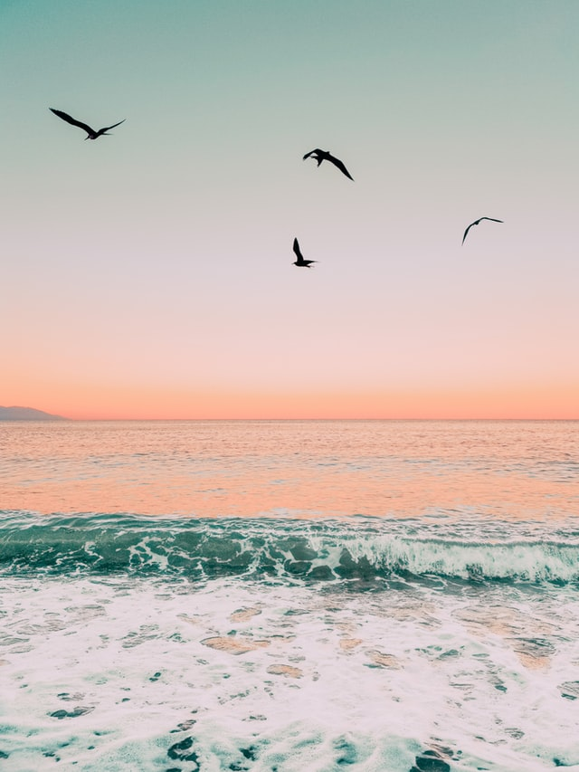

---
title:"Being Stillness"
subtitle:"The Invitation by Oriah Mountain Dreamer"
excerpt: "It doesn’t interest me to know where you live or how much money you have"
date:"23 July 2022"
image:"/public/ocean.jpg"

---

# Being Stillness
#### The Invitation by Oriah Mountain Dreamer

It doesn’t interest me if the story you’re telling me is true.I want to know if you can disappoint another to be true to yourself.I want to know if you can see beauty even when it is not pretty every day, and if you can source your life from God’s presence.

If you can bear the accusation of betrayal and not betray your own soul. I want to know if you can be faithful, and therefore be trustworthy. I want to know if you can live with failure, yours and mine, and still stand on the edge of a lake and shout to the silver of the full moon.

It doesn’t interest me to know where you live or how much money you have. I want to know if you can get up after a night of grief and despair, weary and bruised to the bone -- and do what needs to be done -- for the children.

It doesn’t interest me who you are or how you came to be here. I want to know if you will stand in the center of the fire with me-- and not shrink back. It doesn’t interest me where or what or “with whom you have studied”. I want to know what sustains you from the inside when all else falls away. I want to know if you can be alone with yourself and if you truly like the company you keep -- in the empty moments.

[Learn More](http://www.oriahmountaindreamer.com/)

